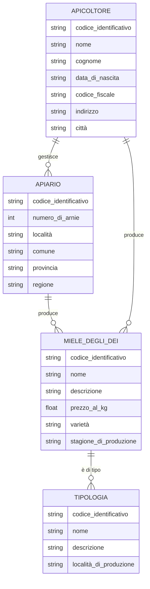

```mermaid
erDiagram
    MIELE_DEGLI_DEI {
    string codice_identificativo
    string nome
    string descrizione
    float  prezzo_al_kg
    string varietà
    string stagione_di_produzione
    }
    
    APICOLTORE {
    string codice_identificativo
    string nome
    string cognome
    string data_di_nascita
    string codice_fiscale
    string indirizzo
    string città
    }

    APIARIO{
    string codice_identificativo
    int    numero_di_arnie 
    string località
    string comune
    string provincia
    string regione
    } 

    TIPOLOGIA {
    string codice_identificativo    
    string nome
    string descrizione
    string località_di_produzione
    }

    MIELE_DEGLI_DEI ||--o{ TIPOLOGIA : "è di tipo"
    APICOLTORE ||--o{ APIARIO : "gestisce"
    APIARIO ||--o{ MIELE_DEGLI_DEI : "produce"
    APICOLTORE ||--o{ MIELE_DEGLI_DEI : "produce"
```

